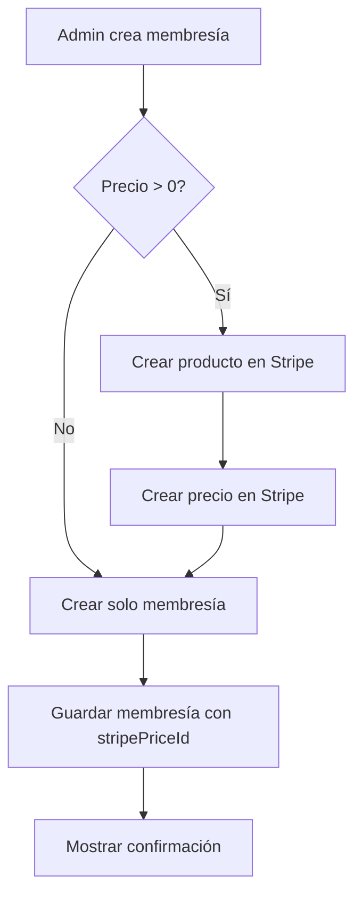

# 🎯 Sistema Unificado de Membresías + Stripe

## 📋 Descripción General

Sistema completamente integrado que crea automáticamente productos en Stripe al crear membresías en AutoDealers. **Un solo lugar, sincronización automática, cero pasos manuales.**

---

## ✅ **PROBLEMA RESUELTO**

### **Antes (Sistema Separado):**
❌ Crear membresía en `/admin/memberships`
❌ Ir a `/admin/stripe/products` 
❌ Crear producto manualmente
❌ Copiar Stripe Price ID
❌ Volver a membresía y pegar ID
❌ Propenso a errores
❌ Tiempo perdido

### **Ahora (Sistema Unificado):**
✅ Crear membresía en `/admin/memberships`
✅ **LISTO** - Todo lo demás es automático

---

## 🚀 **Cómo Funciona**

### **1. Crear Membresía (`/admin/memberships`)**

**Proceso:**
1. Admin hace click en "➕ Crear Membresía"
2. Llena formulario:
   - Nombre: "Plan Premium"
   - Tipo: Dealer o Seller
   - Precio: $99.99
   - Moneda: USD
   - Ciclo: Mensual o Anual
   - Features: Marca las características incluidas
3. Click "✓ Crear Membresía"

**Sistema automáticamente:**
```
1. ⏳ Crea producto en Stripe:
   - Nombre: "Plan Premium - Dealer"
   - Descripción: "Plan de membresía Plan Premium para dealers"
   - Metadata: type=dealer, managedBy=autodealers

2. ⏳ Crea precio en Stripe:
   - Monto: $99.99 USD
   - Recurrencia: Mensual (o Anual)
   - ID generado: price_abc123xyz

3. ⏳ Crea membresía en Firestore:
   - Todos los features y límites
   - stripePriceId: price_abc123xyz (vinculado automáticamente)

4. ✅ Muestra confirmación:
   "✅ Membresía creada exitosamente!
    💳 Producto en Stripe: Creado
    🔗 Stripe Price ID: price_abc123xyz"
```

---

## 💡 **Características Clave**

### **Indicador Visual en el Formulario**

Cuando creas una membresía, verás un recuadro azul que dice:

```
💳 Integración Automática con Stripe

Al crear esta membresía, se creará automáticamente un producto y 
precio en Stripe. No necesitas hacer nada manualmente.

✓ Producto creado en Stripe
✓ Precio configurado: $99.99 USD
✓ Intervalo: Mensual
✓ Vinculación automática
```

Este indicador se actualiza en tiempo real según los valores que ingreses.

### **Badge de Vinculación**

En la lista de membresías, cada una que está vinculada con Stripe muestra:

```
💳 Vinculado con Stripe
```

---

## 📊 **Flujo Completo**



---

## 🔧 **Implementación Técnica**

### **Frontend: CreateMembershipModal.tsx**

**Cambios:**
1. **Eliminado**: Campo manual de `stripePriceId`
2. **Agregado**: Indicador visual de integración Stripe
3. **Agregado**: Flag `createStripeProduct: true` en el body del request
4. **Mejorado**: Mensaje de éxito con detalles de Stripe

### **Backend: `/api/admin/memberships` (POST)**

**Lógica:**
```typescript
if (createStripeProduct && price > 0) {
  // 1. Crear producto en Stripe
  const product = await stripe.products.create({
    name: `${name} - ${type}`,
    description: `Plan de membresía ${name}`,
    metadata: { type, managedBy: 'autodealers' }
  });

  // 2. Crear precio en Stripe
  const stripePrice = await stripe.prices.create({
    product: product.id,
    unit_amount: Math.round(price * 100),
    currency: currency.toLowerCase(),
    recurring: {
      interval: billingCycle === 'monthly' ? 'month' : 'year'
    }
  });

  // 3. Guardar Price ID
  stripePriceId = stripePrice.id;
}

// 4. Crear membresía con stripePriceId vinculado
const membership = await createMembership({
  ...data,
  stripePriceId
});
```

### **Manejo de Errores**

Si Stripe falla (conexión, API Key, etc.):
- ✅ La membresía **SE CREA DE TODAS FORMAS**
- ⚠️ Se logguea un warning
- 📝 `stripePriceId` queda vacío
- 👤 Usuario puede vincular manualmente después

**Mejor experiencia:**
No bloquear la creación de membresías por problemas de Stripe.

---

## 🎨 **Interfaz de Usuario**

### **Modal de Creación**

**Secciones:**
1. **Información Básica:**
   - Nombre de la membresía
   - Tipo (Dealer/Seller)
   - Ciclo de facturación

2. **Precio:**
   - Monto
   - Moneda (USD, EUR, MXN)

3. **💳 Integración Automática con Stripe:**
   - Indicador visual con preview de lo que se creará
   - Actualización en tiempo real

4. **Límites Numéricos:**
   - Máx. vendedores, inventario, campañas, etc.

5. **Features:**
   - Checkboxes organizados por categorías
   - Colapsables con "Mostrar todas"

6. **Features Dinámicas:**
   - Desde `/admin/dynamic-features`
   - Se agregan automáticamente

### **Lista de Membresías**

**Cada tarjeta muestra:**
- Nombre y tipo
- Estado (Activa/Inactiva)
- Precio y ciclo
- **💳 Badge si está vinculado con Stripe**
- Features principales
- Tenants que usan la membresía
- Link para editar

---

## 📦 **Estructura de Datos**

### **Membresía en Firestore**

```json
{
  "id": "mem_abc123",
  "name": "Plan Premium",
  "type": "dealer",
  "price": 99.99,
  "currency": "USD",
  "billingCycle": "monthly",
  "stripePriceId": "price_abc123xyz",  // ← Vinculación automática
  "features": {
    "maxSellers": 10,
    "maxInventory": 100,
    "customSubdomain": true,
    "aiEnabled": true,
    "socialMediaEnabled": true,
    "marketplaceEnabled": true,
    "advancedReports": true
  },
  "isActive": true,
  "createdAt": "2025-12-28T..."
}
```

### **Producto en Stripe**

```json
{
  "id": "prod_abc123",
  "name": "Plan Premium - Dealer",
  "description": "Plan de membresía Plan Premium para dealers",
  "metadata": {
    "type": "dealer",
    "managedBy": "autodealers"
  },
  "active": true
}
```

### **Precio en Stripe**

```json
{
  "id": "price_abc123xyz",
  "product": "prod_abc123",
  "unit_amount": 9999,  // $99.99 en centavos
  "currency": "usd",
  "recurring": {
    "interval": "month",
    "interval_count": 1
  },
  "active": true
}
```

---

## 🔗 **Relación con Otros Módulos**

### **`/admin/stripe`**

**Ahora es solo para:**
- ✅ Ver productos existentes
- ✅ Ver precios y detalles
- ✅ Gestionar suscripciones activas
- ✅ Ver pagos y transacciones
- ✅ Procesar reembolsos
- ❌ NO para crear productos manualmente

**Los productos se crean desde:**
- `/admin/memberships` ← **ÚNICO LUGAR**

### **`/admin/subscriptions`**

Las suscripciones usan los `stripePriceId` vinculados:
```typescript
// Cuando un tenant se suscribe:
const checkout = await stripe.checkout.sessions.create({
  line_items: [{
    price: membership.stripePriceId,  // ← Vinculado automáticamente
    quantity: 1,
  }],
  //...
});
```

---

## ✅ **Ventajas del Sistema**

### **Para el Admin:**
1. **⏱️ Ahorra tiempo**: 5 pasos → 1 paso
2. **🎯 Sin errores**: No hay copiar/pegar manual
3. **🔄 Sincronización automática**: Siempre vinculados
4. **👀 Visibilidad**: Badge muestra qué está vinculado
5. **📋 Un solo lugar**: Todo desde `/admin/memberships`

### **Para el Sistema:**
1. **🔗 Integridad**: Membresías siempre tienen Price ID
2. **🚀 Escalable**: Agregar nuevas monedas/intervalos fácilmente
3. **🛡️ Robusto**: Falla Stripe → Membresía se crea igual
4. **📊 Trazable**: Metadata en Stripe para auditoría
5. **🔧 Mantenible**: Un solo flujo de creación

---

## 🧪 **Cómo Probar**

### **1. Crear Membresía Básica**

```
1. Ve a: http://localhost:3001/admin/memberships
2. Click "➕ Crear Membresía"
3. Llena:
   - Nombre: "Plan Básico"
   - Tipo: Seller
   - Precio: 29.99
   - Moneda: USD
   - Ciclo: Mensual
   - Features: customSubdomain ✓
4. Observa el indicador azul actualizarse
5. Click "✓ Crear Membresía"
6. Verás: "✅ Membresía creada! 💳 Stripe Price ID: price_..."
```

### **2. Verificar en Stripe**

```
1. Ve a: http://localhost:3001/admin/stripe/products
2. Busca "Plan Básico - Vendedor"
3. Verifica que tenga:
   - Precio: $29.99/month
   - Metadata: type=seller, managedBy=autodealers
```

### **3. Verificar Vinculación**

```
1. Ve a: http://localhost:3001/admin/memberships
2. Busca la tarjeta "Plan Básico"
3. Verifica el badge: "💳 Vinculado con Stripe"
```

---

## 📖 **Casos de Uso**

### **Caso 1: Crear Membresía Standard**
```
Admin crea "Plan Estándar" con:
- Precio: $49.99/mes
- Features: IA + Redes Sociales + Reportes

Sistema automáticamente:
✓ Crea producto en Stripe
✓ Genera precio recurrente mensual
✓ Vincula con stripePriceId
✓ Listo para suscripciones
```

### **Caso 2: Crear Membresía Gratis**
```
Admin crea "Plan Free" con:
- Precio: $0.00
- Features limitadas

Sistema:
⚠️  NO crea producto en Stripe (precio = 0)
✓ Crea solo membresía en Firestore
✓ Útil para trials o demos
```

### **Caso 3: Stripe API Falla**
```
Admin crea "Plan Enterprise" con:
- Precio: $299.99/año

Stripe API está caída:
⚠️  Error al crear producto (logged)
✓ Membresía SE CREA de todas formas
✓ Admin puede vincular manualmente después
✓ Sistema sigue funcionando
```

---

## 🔒 **Seguridad**

- ✅ Solo admin puede crear membresías
- ✅ `verifyAuth` en la API
- ✅ Stripe Secret Key en variables de entorno
- ✅ Validación de datos en backend
- ✅ Metadata en Stripe para auditoría

---

## 🎉 **Resumen**

### **Antes:**
```
/admin/memberships → Crear membresía
/admin/stripe/products → Crear producto
Vincular manualmente → Propenso a errores
```

### **Ahora:**
```
/admin/memberships → Crear membresía
                  → Producto Stripe creado automáticamente
                  → Precio configurado automáticamente
                  → Vinculación automática
                  → ¡LISTO!
```

---

## 🌟 **SISTEMA 100% FUNCIONAL Y UNIFICADO**

Ahora puedes:
- ✅ Crear membresías desde un solo lugar
- ✅ Productos en Stripe creados automáticamente
- ✅ Precios vinculados sin intervención manual
- ✅ Ver estado de vinculación en la interfaz
- ✅ Gestionar todo desde `/admin/memberships`

**¡Un solo flujo, cero errores, máxima eficiencia!** 🚀


